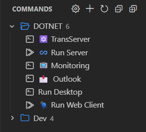
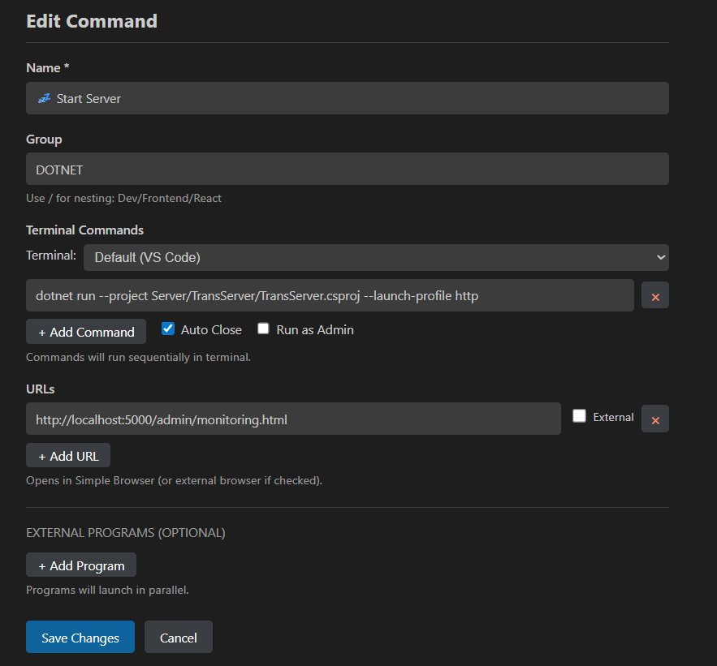

# CMDRun - Command Runner for VS Code

Quick launcher for terminal commands, URLs, and external programs from the sidebar.

---

☕ **Like it?** Buy me a coffee so I can mass-produce more extensions at 3 AM → [ko-fi.com/yaroslavhorokhov](https://ko-fi.com/yaroslavhorokhov)

---

## Screenshots

| Command Panel | Edit Command |
|:-------------:|:------------:|
|  |  |

---

## Features

### 🖥️ Terminal Commands
Run commands in VS Code terminal or external terminals (CMD, PowerShell, Git Bash, WSL, Windows Terminal).

```json
{
  "name": "Build & Run",
  "commands": ["npm install", "npm run build", "npm start"],
  "autoClose": true
}
```

**Options:**
- `autoClose` - close terminal after execution
- `terminalProfile` - select external terminal (Command Prompt, PowerShell, Git Bash, etc.)
- `runAsAdmin` - run with elevated privileges (Windows)

### 🌐 URLs
Open URLs in VS Code Simple Browser or external browser.

```json
{
  "name": "Dev Server",
  "commands": ["npm run dev"],
  "urls": [
    { "url": "http://localhost:3000" },
    { "url": "http://localhost:3000/api", "external": true }
  ]
}
```

### ⚙️ External Programs
Launch any application with arguments.

```json
{
  "name": "Open in VS",
  "programs": [
    {
      "path": "C:\\Program Files\\Microsoft Visual Studio\\devenv.exe",
      "args": "MyProject.sln"
    }
  ]
}
```

```json
{
  "name": "Chrome App",
  "programs": [
    {
      "path": "C:\\Program Files\\Google\\Chrome\\Application\\chrome.exe",
      "args": "--profile-directory=\"Profile 2\" --app=\"https://outlook.office365.com\""
    }
  ]
}
```

### 📁 Groups
Organize commands into nested groups.

```json
{
  "name": "Start Server",
  "group": "Dev/Backend",
  "commands": ["dotnet run"]
}
```

## Full Example

```json
{
  "commands": [
    {
      "name": "🚀 Start Dev",
      "group": "Project",
      "commands": ["npm run dev"],
      "urls": [{ "url": "http://localhost:5173" }],
      "autoClose": true
    },
    {
      "name": "🔨 Build",
      "group": "Project",
      "commands": ["npm run build"],
      "terminalProfile": "PowerShell",
      "autoClose": true
    },
    {
      "name": "📧 Outlook",
      "group": "Apps",
      "programs": [{
        "path": "C:\\Program Files\\Google\\Chrome\\Application\\chrome.exe",
        "args": "--app=\"https://outlook.office365.com\""
      }]
    },
    {
      "name": "📝 Notepad + Calc",
      "group": "Apps",
      "programs": [
        { "path": "notepad.exe" },
        { "path": "calc.exe" }
      ]
    }
  ]
}
```

## Config Location

`.vscode/cmdrun.json` in your workspace.

## Keyboard & Actions

- **Click** - Run command
- **Right-click** - Edit / Delete / Duplicate
- **Drag & Drop** - Reorder commands

---

**GitHub:** [github.com/yarhoroh/CMDRun](https://github.com/yarhoroh/CMDRun)

Made with ⚡ for productivity
